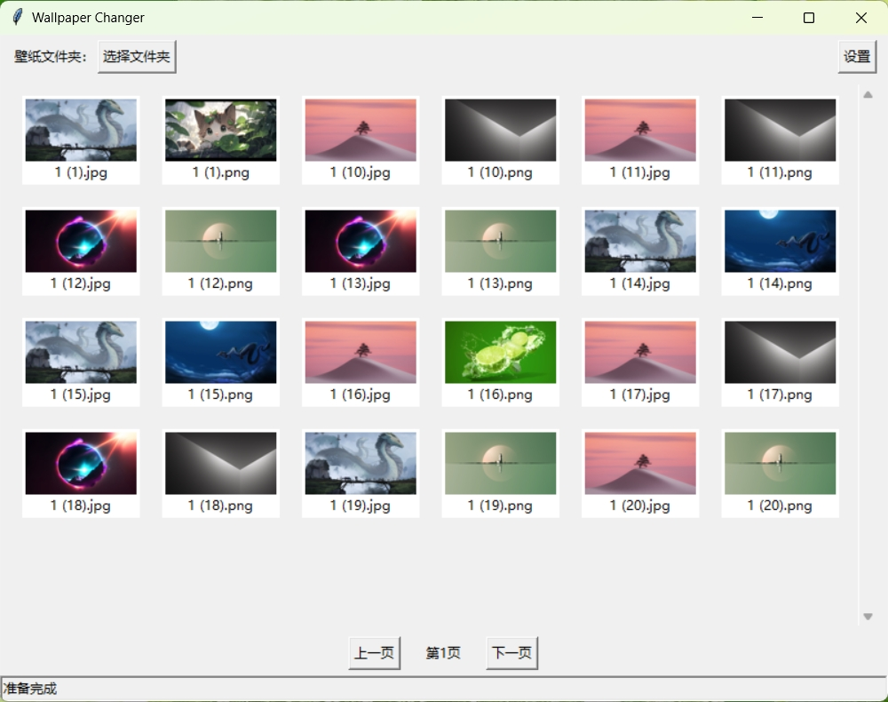

# WallpaperCube

## Table of Contents
<u>[English Version](#wallpapercube-english-version)</u>  |  <u>[中文版](#wallpapercube-中文版)</u>
---

# WallpaperCube (English Version)

WallpaperCube is a desktop wallpaper management application designed to enhance your experience with wallpapers. With an intuitive interface and powerful features, WallpaperCube makes it easy to organize, select, and customize your wallpapers to suit your preferences.

## Current Features

- **Folder Selection:** Choose a folder containing your wallpapers and manage them within the app.
- **Thumbnail Previews:** Quickly view thumbnails of all wallpapers in the selected folder.
- **Wallpaper Application:** Apply a selected wallpaper to your desktop with a single click.
- **Language Support:** Switch between multiple languages for the user interface (currently supports English and Chinese).
- **Customizable UI:** Easy-to-use settings to adjust app behavior and appearance.

## Upcoming Features

WallpaperCube aims to evolve into a more comprehensive wallpaper management solution. Below are the features planned for future releases:

- **Custom Wallpaper Upload:** Allow users to upload their wallpapers directly into the app for better organization.
- **Personal Account Synchronization:** Enable account-based storage and synchronization of wallpapers across devices.
- **Wallpaper Switching Modes:** Add features like automatic wallpaper switching based on a time interval.
- **Dynamic Wallpapers:** Introduce support for dynamic or animated wallpapers.
- **Wallpaper Library Integration:** Provide links to online wallpaper libraries for easy access to new content.
- **Enhanced UI Personalization:** Allow further customization of the app's appearance and functionality.

## How to Use

1. **Select a Folder:** Use the "Select Folder" button to choose a directory containing your wallpapers.
2. **Preview Wallpapers:** Browse the thumbnails to find the wallpaper you like.
3. **Set Wallpaper:** Click on a wallpaper to set it as your desktop background.
4. **Change Language:** Go to settings to switch between supported languages.

## Contributing
We welcome contributions to improve WallpaperCube. If you have ideas, suggestions, or code to contribute, please feel free to create an issue or submit a pull request.

## Feedback
Your feedback is important to us! If you encounter any issues or have feature requests, please let us know.

## Screenshots

### English Interface

---

# WallpaperCube (中文版)

WallpaperCube 是一个桌面壁纸管理应用程序，旨在提升您使用壁纸的体验。通过直观的界面和强大的功能，WallpaperCube 让您轻松地组织、选择和定制壁纸，以满足您的偏好。

## 当前功能

- **文件夹选择：** 选择包含壁纸的文件夹，并在应用中进行管理。
- **缩略图预览：** 快速查看所选文件夹中所有壁纸的缩略图。
- **壁纸应用：** 一键将选定的壁纸设置为桌面背景。
- **多语言支持：** 支持多语言界面切换（目前支持英文和中文）。
- **自定义界面：** 简单易用的设置界面，用于调整应用的行为和外观。

## 即将推出的功能

WallpaperCube 计划发展为更全面的壁纸管理解决方案。以下是未来版本计划的功能：

- **自定义壁纸上传：** 允许用户将壁纸直接上传到应用中以便更好地管理。
- **个人账户同步：** 启用基于账户的存储和跨设备同步功能。
- **壁纸切换模式：** 添加自动切换壁纸功能，例如基于时间间隔切换壁纸。
- **动态壁纸：** 支持动态或动画壁纸。
- **壁纸库链接：** 提供在线壁纸库的链接，便于获取新内容。
- **增强的界面个性化：** 允许进一步自定义应用外观和功能。

## 使用方法

1. **选择文件夹：** 使用“选择文件夹”按钮选择包含壁纸的目录。
2. **预览壁纸：** 浏览缩略图，找到您喜欢的壁纸。
3. **设置壁纸：** 点击壁纸即可将其设置为桌面背景。
4. **切换语言：** 进入设置以切换支持的语言。

## 贡献
我们欢迎对 WallpaperCube 的改进建议和代码贡献。如果您有想法、建议或代码贡献，请随时创建问题或提交拉取请求。

## 反馈
您的反馈对我们非常重要！如果您遇到任何问题或有功能需求，请告诉我们。

## 界面截图

### 中文界面

---

